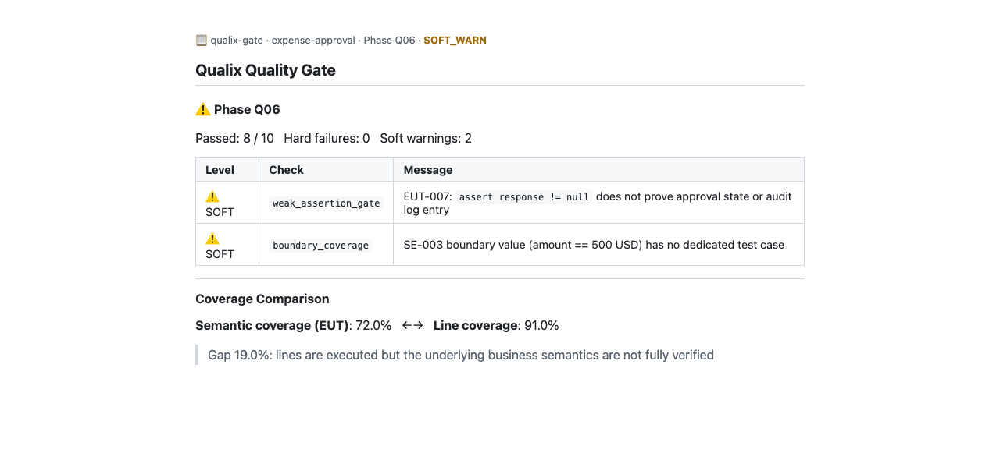

# CI Integration

Qualix provides a GitHub Actions composite action and a pre-commit hook for gating on phase verdicts. Both are zero-LLM — they read existing verdict files produced by `qualix-run finalize` and `qualix-run approve`.

## How It Works

The gate reads `_gate_verdict.json` files from your output directory. It does not re-run any phase or call any model.

```
qualix-run finalize Q06   # produces _gate_verdict.json (needs LLM, runs once)
qualix-run approve Q06    # marks phase approved

qualix-run ci-gate Q06    # reads verdicts, exits 0 or 1 (no LLM, runs on every push)
```

The typical workflow is: run the full pipeline once locally or in a dedicated CI job, approve the phases you are satisfied with, then gate every subsequent push against those verdicts.

## GitHub Actions

### Minimal Setup

```yaml
# .github/workflows/qualix-gate.yml
name: Qualix Gate

on: [push, pull_request]

jobs:
  gate:
    runs-on: ubuntu-latest
    steps:
      - uses: actions/checkout@v4

      - uses: alexangelzhang/qualix@v0.2.0a1
        with:
          project-id: my-project
          phase: Q06
          fail-on: hard
```

### All Phases

```yaml
      - uses: alexangelzhang/qualix@v0.2.0a1
        with:
          project-id: my-project
          phase: all
          fail-on: hard
```

### Soft Warnings (Non-Blocking)

```yaml
      - uses: alexangelzhang/qualix@v0.2.0a1
        with:
          project-id: my-project
          phase: Q06
          fail-on: soft       # SOFT warnings also fail the job
        continue-on-error: true   # or use continue-on-error to surface warnings without blocking
```

### Inputs

| Input | Required | Default | Description |
| --- | --- | --- | --- |
| `project-id` | yes | — | Qualix project ID, matching the directory under `output/` |
| `phase` | no | `Q06` | Phase ID (`Q01`–`Q07`) or `all` |
| `fail-on` | no | `hard` | `hard` — only hard blocks fail; `soft` — soft warnings also fail; `any` — any non-pass fails |
| `output-dir` | no | `output` | Path to the Qualix output directory |
| `post-summary` | no | `true` | Write a markdown summary to the GitHub Step Summary |

### Outputs

| Output | Description |
| --- | --- |
| `verdict` | `PASS`, `HARD_BLOCK`, or `SOFT_WARN` |
| `semantic-coverage` | Semantic coverage rate at EUT granularity, `0.0`–`1.0` |

### PR Comment Example

When `post-summary: true` (default), Qualix writes a structured finding table to the GitHub Step Summary. It appears in the Actions tab of your pull request:



## pre-commit

Gate on push after the pipeline has been run and phases approved:

```yaml
# .pre-commit-config.yaml
repos:
  - repo: https://github.com/alexangelzhang/qualix
    rev: v0.2.0a1
    hooks:
      - id: qualix-gate
        args: [my-project, ci-gate, --fail-on, hard]
```

Requires `pip install qualix` and a project initialized with `qualix-run my-project init`.

## fail-on Semantics

| Level | When it fires | Typical use |
| --- | --- | --- |
| `hard` | Any hard-blocked check | Block merges on critical failures |
| `soft` | Hard blocks OR soft warnings | Strict mode — surface all issues |
| `any` | Any non-passing check | Maximum strictness |

Hard failures indicate missing required artifacts or structural violations. Soft warnings indicate quality concerns that do not prevent approval.

## Storing Phase Outputs in CI

Phase verdict files (`_gate_verdict.json`) need to be accessible at gate time. Two common patterns:

**Pattern A — Commit outputs to the repository**

Add the `output/` directory to your repo. Run the full pipeline in a separate job or locally, commit the verdicts, then gate on every push.

**Pattern B — Artifact upload/download**

```yaml
# Pipeline job
- name: Run Qualix pipeline
  run: |
    qualix-run my-project execute Q06 --json
    qualix-run my-project finalize Q06 --json
    qualix-run my-project approve Q06 --json

- uses: actions/upload-artifact@v4
  with:
    name: qualix-verdicts
    path: output/

# Gate job (depends on pipeline job)
- uses: actions/download-artifact@v4
  with:
    name: qualix-verdicts
    path: output/

- uses: alexangelzhang/qualix@v0.2.0a1
  with:
    project-id: my-project
```

## Local CI Gate

Run the same check locally before pushing:

```bash
qualix-run my-project ci-gate Q06 --fail-on hard --json
```

Exit code 0 = pass, 1 = blocked.
